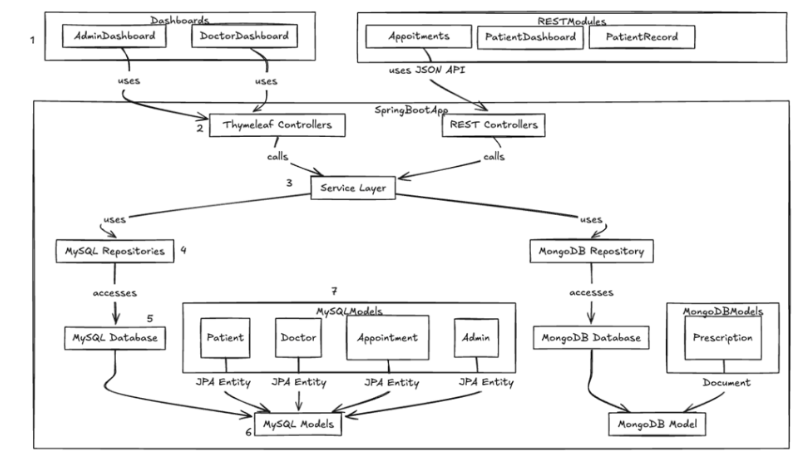

This Spring Boot application follows the MVC pattern within a RESTful API architecture.  
The frontend uses Thymeleaf to render HTML templates, while the backend is structured using Spring Boot,
with Spring Data JPA for MySQL and Spring Data MongoDB for managing prescriptions.

The technologies used are listed below.

## Technologies Used
- **Spring Boot**: For building the application.
- **Spring Data JPA**: For interacting with the MySQL database.
- **Spring Data MongoDB**: For interacting with the MongoDB database.
- **Thymeleaf**: For rendering HTML templates on the frontend.
- **Spring Security**: For securing the application.
- **Spring Modulith**: For modular application architecture.
- **MySQL**: For relational data storage.
- **MongoDB**: For document-based storage of prescriptions.
- **Lombok**: For reducing boilerplate code.
- **JUnit**: For unit testing.
- **Mockito**: For mocking dependencies in tests.
- **TestContainers**: For integration testing with containers.
- **Swagger/OpenAPI**: For documenting the API.
- **Docker**: For containerizing the application.

## Architecture Overview

The application is divided into two main modules:  
one for handling user interaction, and another for handling API calls from the frontend.

The **frontend module** includes two dashboards: `AdminDashboard` and `DoctorDashboard`.

On the frontend, API calls are handled by three REST modules: `Appointments`, `PatientDashboard`, and `PatientRecord`.

The dashboards have direct access to **Thymeleaf controllers**, which are responsible for rendering HTML content.

The **REST modules** that handle API requests are responsible for the **business logic**, and interact with **REST controllers**.

Both types of controllers interact with a **service layer**, which in turn accesses the database through the
`MySqlRepositories` and `MongoDbRepository`.

Repositories have access to the **domain layer**, including models/entities, and interact directly with the databases.

👉 Next: [How to build/run the project](./SETUP.md)